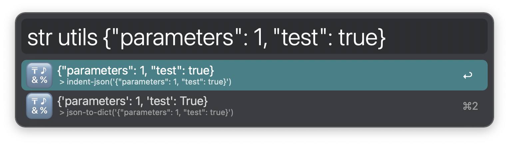
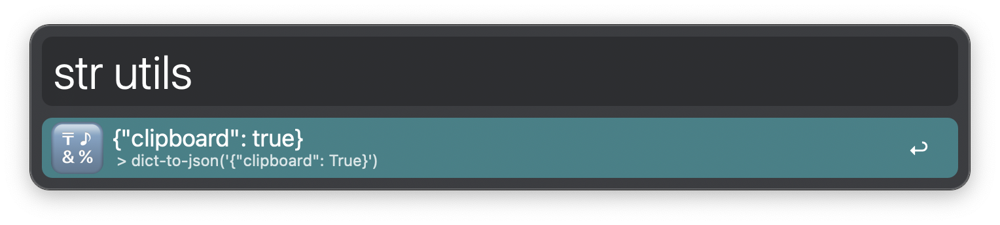
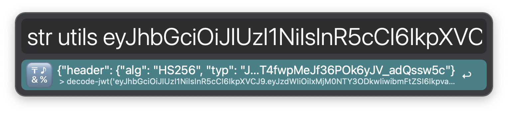

## ALFRED-STRING-TOOLKIT

[Alfred Workflow](https://www.alfredapp.com/workflows/) to run different sets of string manipulation tools 🔤️

### FUNCTIONS

#### *️⃣ str base

Apply a base to a string.

Also decode a base when possible!

#### 🔠 str case

Change the case of a string.

#### #️⃣ str hash

Apply a hash to a string.

#### ℹ️ str info

Get information about a string.

#### 🔀 str lipsum

Generate a random amount of lorem ipsum paragraphs, sentences or words. 

#### 🔣️ str utils

Execute different string manipulation utilities on a string

