## ALFRED-STRING-TOOLKIT

[Alfred Workflow](https://www.alfredapp.com/workflows/) to run different sets of string manipulation tools 🔤️

### FUNCTIONS

#### 🔠 case

Change the case of a string.

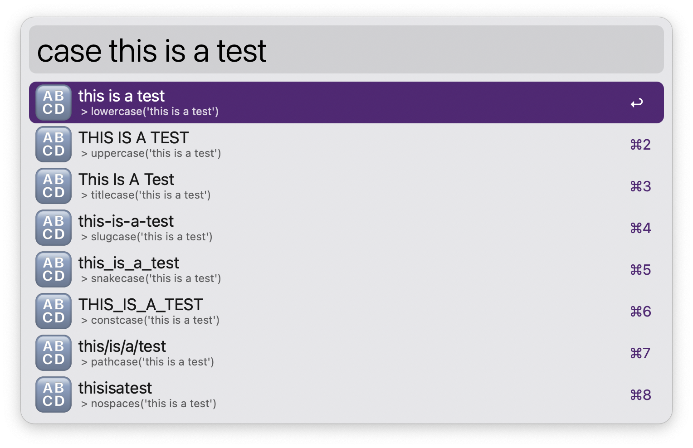

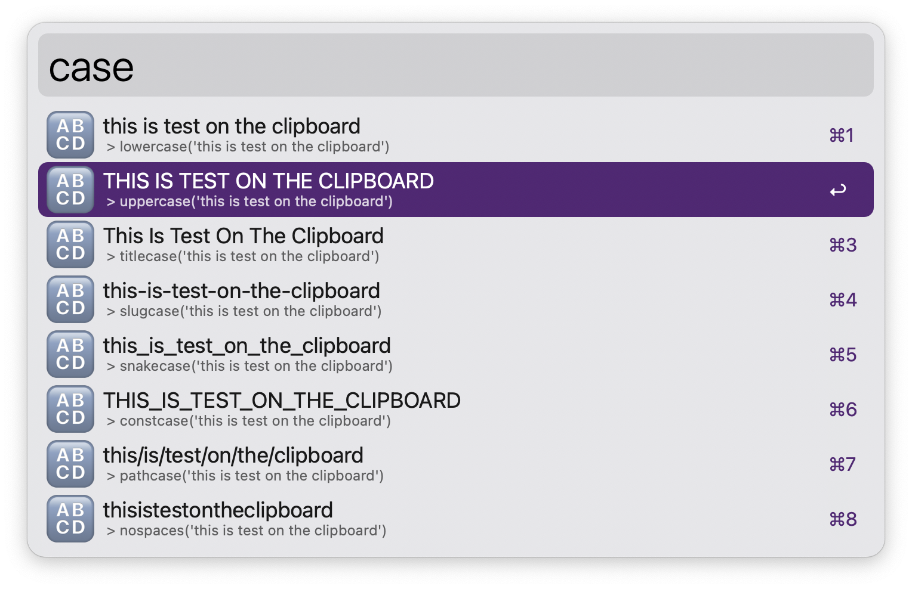

#### *️⃣ base

Apply base 64/32/16 to a string.

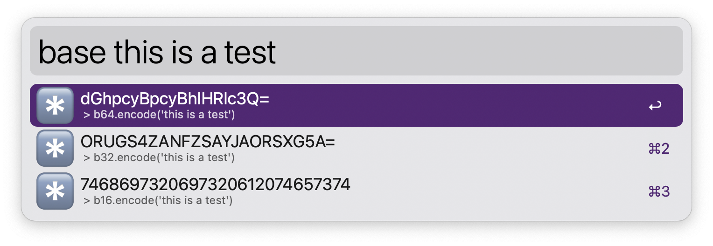

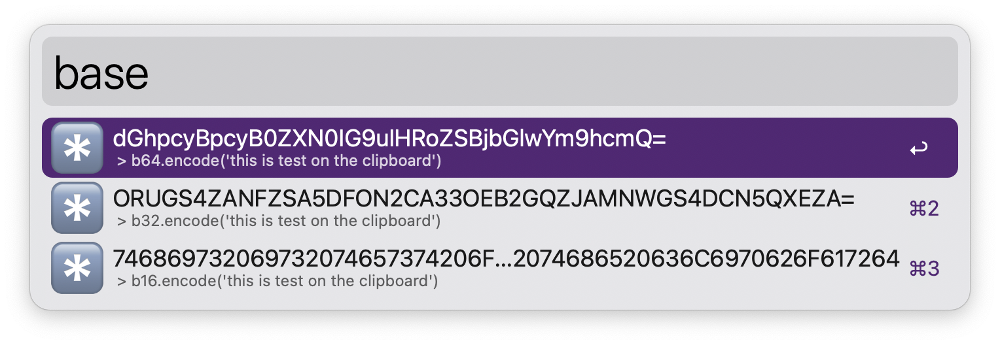

Also decode a base64/32/16 string when possible!

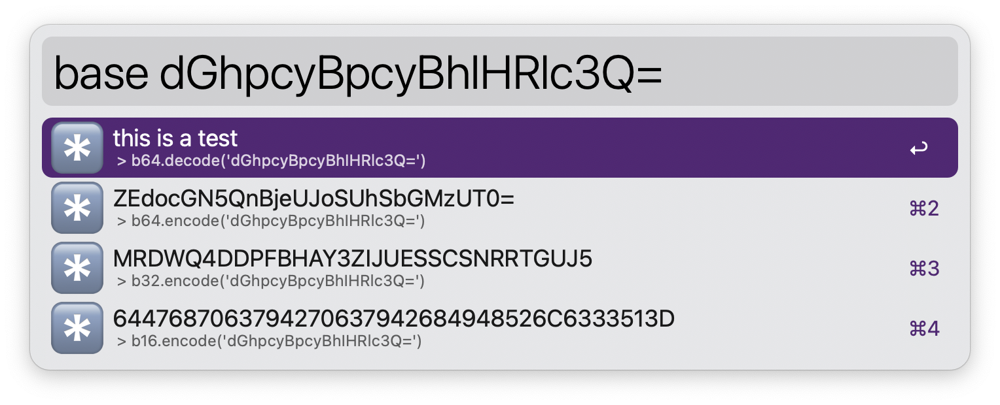

#### #️⃣ hash

Apply a hash to string.

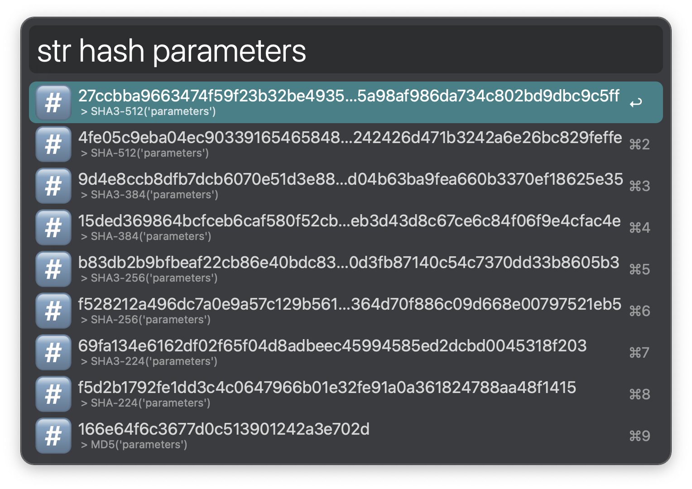

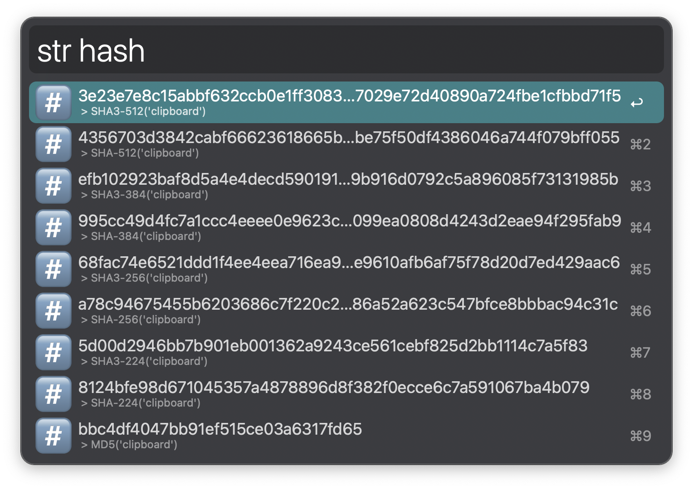

#### ℹ️ info

Get information about a string.

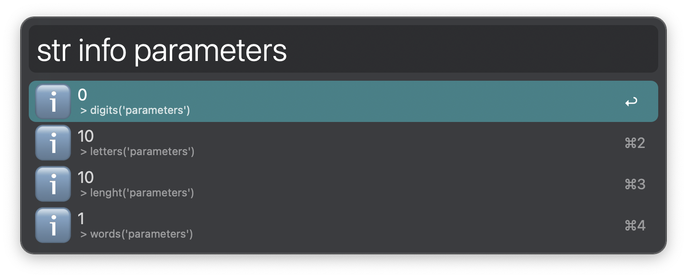

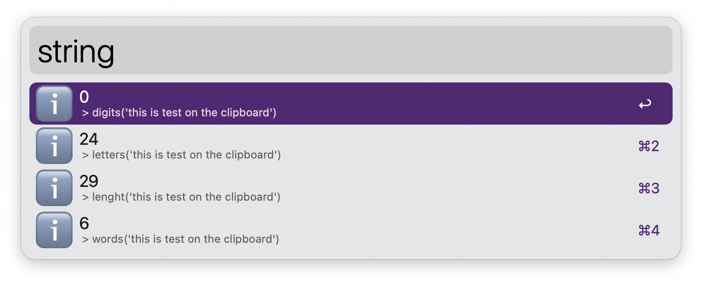

#### 🔀 lipsum

Generate random lorem ipsum paragraphs, sentences or words.

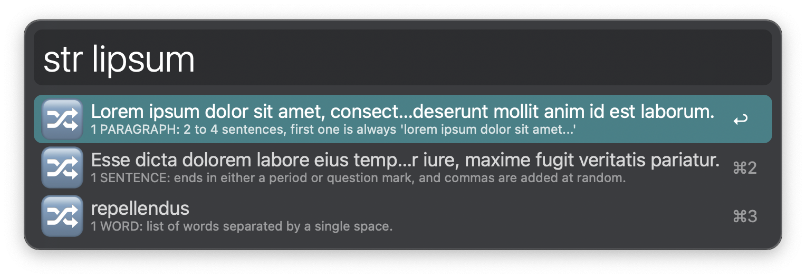

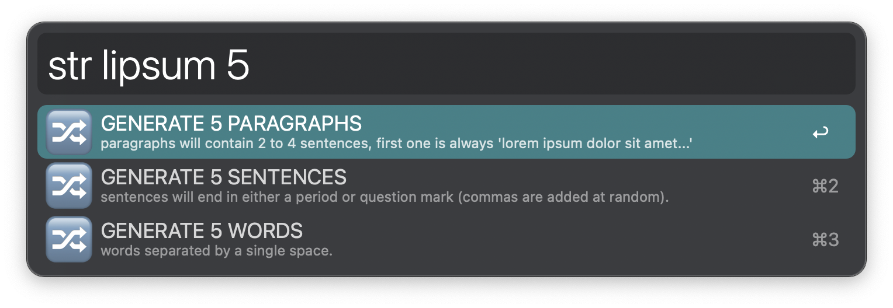
