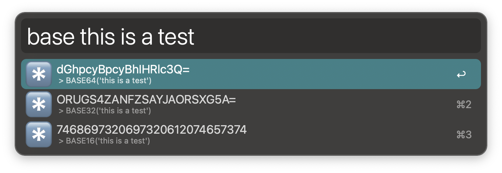
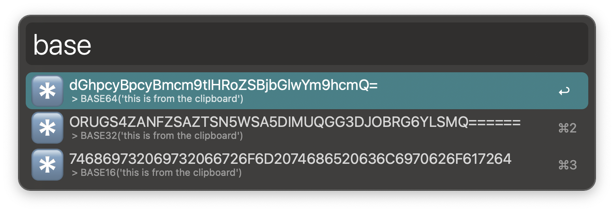
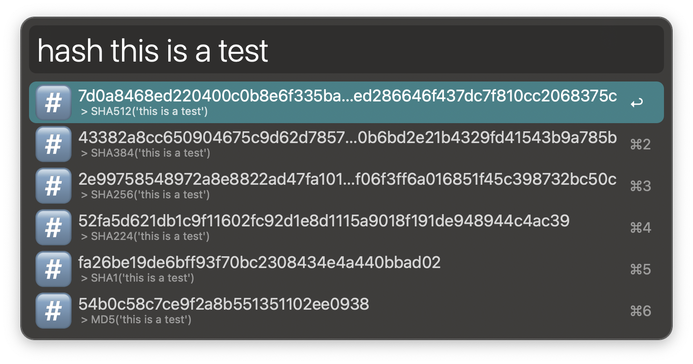
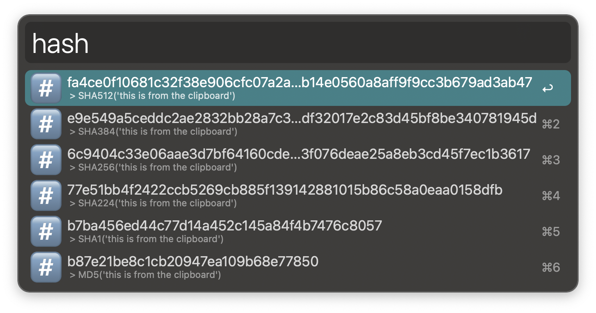
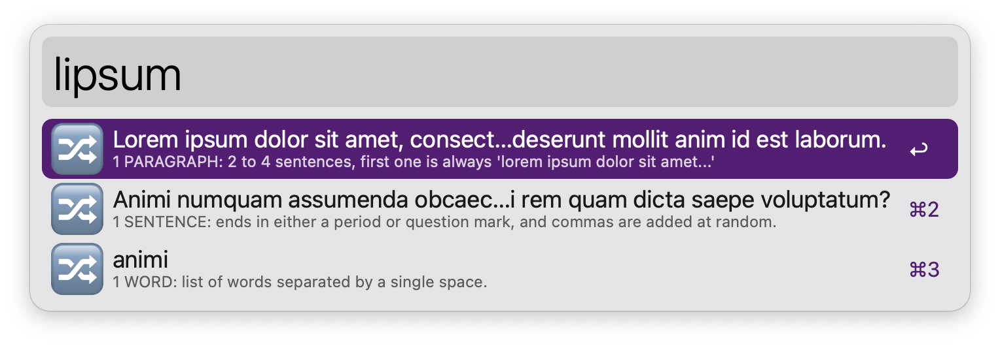
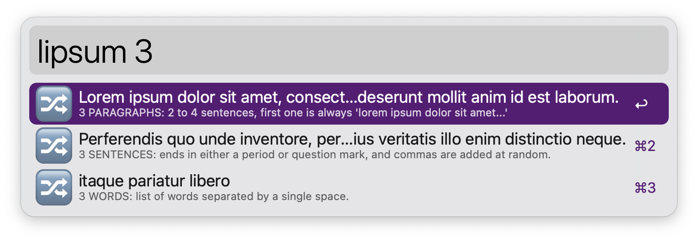

## ALFRED-STRING-TOOLKIT

[Alfred Workflow](https://www.alfredapp.com/workflows/) to apply different tools to strings 🔤️

### FUNCTIONS

#### 🔠 case

Change the case of a string (either from param or from clipboard)

#### *️⃣ base

Apply a base to string (from param or from clipboard)

#### #️⃣ hash

Apply a hash to string (from param or from clipboard)

Generate an amount of random lorem ipsum paragraphs, sentences or words.

#### 🔀 lipsum

